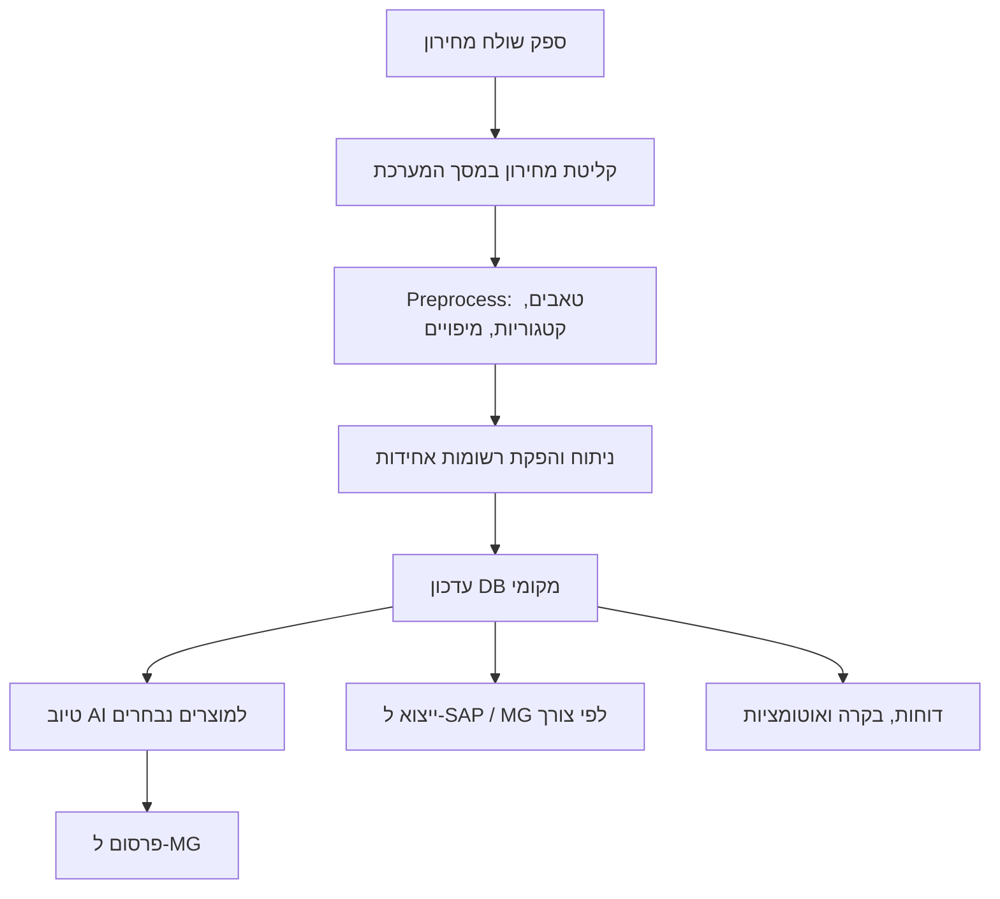

<div dir="rtl">

# חוברת מערכת KING GAMES Automation Manager (גרסה 0.86)

מסמך זה מיועד למשתמשים מתחילים, למנהלי תוכן, לאנשי תפעול ולמנהלי פרויקטים.
המטרה היא להסביר בצורה ברורה מה המערכת עושה, איך עובדים איתה ביום-יום, ומה קורה ברקע.

---

## 1) מה המערכת עושה ומה המטרות שלה

### מטרות עיקריות
1. לנהל קטלוג מוצרים בצורה מרוכזת מתוך מסך אחד.
2. לקלוט מחירונים מספקים בפורמטים שונים (CSV / Excel), להפוך אותם לנתונים אחידים, ולשמור היסטוריה.
3. לבצע טיוב תוכן ומאפיינים למוצרים (כולל AI), ואז לפרסם בצורה מבוקרת לאתר MG.
4. לנהל ספקים, אנשי קשר, מיפויים, אוטומציות ותהליכים מתוזמנים.
5. לשלב עבודה מול מערכות חיצוניות (SAP, Google Sheets).
6. להפעיל מנגנוני חילוץ תמונות לפי ספקים ולשפר איכות נתוני מוצר.

### ערך עסקי
- קיצור משמעותי בזמן קליטת מחירונים.
- הפחתת טעויות אנוש בהקלדה ידנית.
- שיפור איכות דפי מוצר לפני פרסום.
- שקיפות תפעולית: רואים מה רץ, מתי רץ, ומה נכשל.
- מעקב היסטורי מלא על שינויים ותהליכים.

---

## 2) למי המערכת מיועדת

1. משתמש מתחיל/תפעול: קליטת מחירון, בדיקות בסיסיות, הפעלת תהליכים.
2. מנהל קטלוג: טיוב מוצרים, תיאורים, מאפיינים, תמונות.
3. מנהל רכש/ספקים: ניהול ספקים, מיפויים, תדירות קליטה.
4. מנהל מערכות: תהליכים אוטומטיים, אינטגרציות SAP/Google, ניטור תקלות.

---

## 3) מבנה המערכת (ארכיטקטורה פשוטה)

### רכיבים מרכזיים
1. ממשק משתמש (Dashboard + מסכים):
   - index.html
   - app.js
   - style.css
2. שרת API מקומי:
   - server.py
3. בסיס נתונים SQLite:
   - products.db
4. סקריפטים של עיבוד:
   - update_products_batch_2.py
   - mg_import_runner.py
   - run_price_check.py
   - process_google_prices_update.py
   - process_google_prices_update_clone.py
   - process_product_agent_output_queue.py
   - supplier_image_extraction_runner.py
   - scrape_cms_parameters.py
5. מנוע טיוב מוצרים:
   - product_scraper_engine/
6. מנגנון קליטת פלט סוכן טיוב:
   - product_agent_output_importer.py
   - product_agent_outputs/ (incoming, processing, failed)

### תרשים זרימה ברמת על



---

## 4) מודולים עיקריים והסבר תפקידם

## 4.1 Dashboard ראשי
מה רואים:
1. תהליכים רצים כרגע.
2. עיבוד אחרון ועיבוד הבא.
3. סטטוס סוכן טיוב מוצרים (כולל כפתורי הפעל/עצור ולוג חי).
4. תובנות מכירה וצרכי קליטת מחירונים.

למה זה חשוב:
- זה המסך הראשון לבקרה תפעולית.
- מאפשר לזהות עומס, תקיעות או תהליך שלא רץ בזמן.

## 4.2 ניהול מוצרים
תפקיד:
- חיפוש/סינון מוצרים, פתיחת כרטיס מוצר, עדכון שדות ומאפיינים.

בכרטיס מוצר:
1. פרטים כלליים.
2. תיאורים.
3. ספקים.
4. מאפייני קטגוריה.
5. כל המאפיינים.
6. המלצות לתיקון (מהסוכן) - אם קיימות.

## 4.3 קליטת מחירון ספק
תפקיד:
- קבלת קבצים מספקים, מיפוי עמודות, הפיכת נתונים לפורמט אחיד, ושמירה בבסיס הנתונים.

נקודות מפתח:
- עובד עם מיפוי לפי טאבים.
- מאפשר טקסט קבוע לשדה אם אין עמודה.
- מאפשר הפעלה/כיבוי טאבים.
- מאפשר תמחור לפי קטגוריה ומותג.

## 4.4 ניהול ספקים ואנשי קשר
תפקיד:
- הגדרת ספקים, תדירות קליטה, אנשי קשר, סטטוס אינטגרציה.

למה זה חשוב:
- כל תהליך קליטה מתחיל מהגדרה נכונה של ספק.

## 4.5 ניהול מחירונים
תפקיד:
- יצירת מחירונים מנוהלים, קישור לספקים, ושמירת מיפוי קלט.

## 4.6 עיבודים (Processes)
תפקיד:
- ניהול משימות אוטומטיות: מה רץ, מתי רץ, האם הצליח, ומה הודעת השגיאה.

דוגמאות לתהליכים:
1. עדכוני Google.
2. בדיקות מחיר יומיות.
3. עיבוד פלט סוכן טיוב מוצרים (07:00).

## 4.7 חילוץ תמונות לפי ספקים
תפקיד:
- להריץ סקריפטים ייעודיים לכל ספק כדי להביא תמונות איכותיות למוצרים.

---

## 5) הסבר מקיף: צורת קליטת מחירון

### שלב א': הכנת ספק ומיפוי
1. נכנסים למסך ספקים או מחירונים.
2. בוחרים ספק/מחירון.
3. מעלים קובץ דוגמה (CSV/XLSX).
4. לוחצים סרוק קובץ.
5. ממפים שדות חשובים:
   - supplier_sku
   - title
   - price
   - stock/availability
   - category / brand

### שלב ב': Analyze (ניתוח)
מה קורה:
1. המערכת קוראת את הקובץ.
2. מזהה טאבים/עמודות.
3. מיישמת מיפוי שמור.
4. בונה preview אחיד.

### שלב ג': Preprocess
מה עושים:
1. בוחרים אילו טאבים פעילים.
2. בוחרים קטגוריות לעיבוד.
3. מגדירים מקדמי תמחור לפי קטגוריה/מותג.

מה קורה ברקע:
- המערכת מיישמת כללי תמחור ומנרמלת רשומות.

### שלב ד': Apply / Import
מה קורה:
1. הנתונים נשמרים בבסיס הנתונים.
2. נוצרות רשומות חדשות/מעודכנות.
3. היסטוריית קליטות נשמרת (כולל תאריך ותוצאות).

### שלב ה': יצוא לפי צורך
1. יצוא ל-SAP intake.
2. יצוא ל-MG (לפי פורמט נדרש).
3. בניית קבצי ביניים להמשך זרימה עסקית.

### דוגמה פשוטה למיפוי

קובץ ספק:
- עמודה A: SKU
- עמודה B: Name
- עמודה C: Cost
- עמודה D: Available

מיפוי מערכת:
- supplier_sku <- A
- title <- B
- raw_price <- C
- availability <- D

תוצאה:
- המערכת יודעת לחשב מחיר סופי לפי כללי תמחור ולהחליט אם המוצר פעיל לקליטה.

---

## 6) הסבר מקיף: העלאת מוצרים ל-MG אחרי טיוב AI

## 6.1 עיקרון חשוב
יש שני שלבים נפרדים:
1. טיוב מקומי (Local Enrichment) - AI + עיבוד תוכן/מאפיינים נשמרים ב-DB.
2. פרסום ל-MG (Publish) - שימוש בנתונים המשופרים מה-DB.

## 6.2 שלב טיוב (AI)
מה קורה:
1. המערכת אוספת נתוני מוצר (כותרת, מאפיינים, טקסטים, תמונות זמינות).
2. מפעילה מנוע טיוב (product_scraper_engine + לוגיקות AI).
3. שומרת את התוצאה המקומית:
   - תיאור משופר
   - מאפיינים ממופים
   - דוחות טיוב

## 6.3 שלב פרסום ל-MG
מה קורה:
1. נפתח חיבור אוטומטי ל-CMS/MG.
2. מוזנים שדות מוצר (שם, תיאור, מחירים, מלאי, מאפיינים).
3. אם יש תמונות תקינות - מתבצעת העלאה.
4. נשמר סטטוס הצלחה/כישלון בלוג וב-DB.

## 6.4 פלט סוכן טיוב מוצרים
הסוכן יכול לייצר JSON עם המלצות.
המערכת:
1. קוראת קבצים מתיקיית queue.
2. מעבדת אותם ברקע.
3. שומרת תוצאות בטבלת המלצות.
4. מציגה אותן בכרטיס מוצר דרך "המלצות לתיקון".

דוגמת JSON רעיונית:

```json
{
  "product_id": "34211",
  "audit": {
    "needs_changes": true,
    "overall_severity": "medium",
    "notes": [
      "להשלים מפרט זיכרון",
      "להחליף ניסוח בכותרת"
    ]
  }
}
```

---

## 7) ספקים, מחירונים, אוטומציות, תמונות מהאתר

## 7.1 ספקים
כל ספק כולל:
1. פרטי קשר.
2. תדירות עדכון.
3. סוג אינטגרציה.
4. קישור למיפוי מחירון.

## 7.2 מחירונים
לכל מחירון ניתן להגדיר:
1. ספק/ים מקושרים.
2. מיפוי שדות.
3. הפעלה לפי טאבים.
4. כללי תמחור.

## 7.3 אוטומציות
מסך העיבודים מאפשר:
1. להוסיף תהליך.
2. לבחור תדירות.
3. להפעיל/לכבות.
4. לראות שגיאות אחרונות.

## 7.4 תמונות מהאתר
זרימה:
1. מזינים רשימת מק"טים.
2. בוחרים ספקים.
3. מפעילים חילוץ.
4. המערכת מריצה סקריפטים של ספקים ושומרת תמונות מקומית.

---

## 8) FLOW מלא של המערכת (מה עושים ומה קורה ברקע)

### מה המשתמש עושה
1. מגדיר ספקים ומיפויים.
2. מעלה מחירון ומריץ Analyze.
3. בוחר הגדרות Preprocess.
4. מפעיל Apply.
5. מפעיל טיוב AI למוצרים נבחרים.
6. מפרסם ל-MG.
7. עוקב אחרי עיבודים בדשבורד ובמסך עיבודים.

### מה המערכת עושה ברקע
1. ניתוח קבצים ונרמול נתונים.
2. חישובי תמחור לפי כללים.
3. שמירה ל-DB והיסטוריית ריצות.
4. הרצת תהליכים מתוזמנים.
5. צריכת תוצאות סוכן טיוב מקבצי JSON.
6. כתיבת לוגים וסטטוסים מפורטים.

---

## 9) הסבר על העיבודים (Processes)

במסך עיבודים תראו לכל תהליך:
1. שם תהליך.
2. סקריפט רץ.
3. אינטרוול (דקות/ימים וכו').
4. פעיל/כבוי.
5. ריצה אחרונה וסטטוס אחרון.
6. הודעת שגיאה אחרונה.

סטטוסים נפוצים:
1. idle - ממתין.
2. running - כרגע רץ.
3. success - הסתיים בהצלחה.
4. failed - נכשל.

---

## 10) אינטגרציה ל-SAP

### מה עושים עם SAP
1. קליטת/עדכון מיפויי ספקים (MG -> SAP).
2. הפקת קבצי intake/SQL לפי זרימה עסקית.
3. דוחות מכירה.
4. דוחות החזרות לספק.

### תוצרים
1. קובצי ביניים לסנכרון.
2. טבלאות סטטוס על הצלחה/כישלון.
3. דוחות במסך הייעודי.

---

## 11) אינטגרציה לגוגל (Google Sheets)

### שימושים
1. עדכוני מחירים/מכירות ללוחות בקרה.
2. תהליכים יומיים/חודשיים מתוזמנים.

### מה חשוב למתחילים
1. חייב להיות קובץ הרשאות service account תקין.
2. חייב Spreadsheet ID נכון.
3. תהליך אמור להופיע במסך עיבודים עם סטטוס הצלחה/כשל.

---

## 12) תסריטי עבודה למתחילים (Step-by-Step)

## תרחיש 1: קליטת מחירון בסיסית
1. היכנסו למסך קליטת מחירון ספק.
2. בחרו ספק והעלו קובץ.
3. לחצו Analyze.
4. הגדירו Preprocess.
5. לחצו Apply.
6. בדקו במסך ההיסטוריה שהקליטה נשמרה.

## תרחיש 2: טיוב + פרסום ל-MG
1. בחרו מוצרים.
2. הריצו טיוב AI.
3. פתחו כרטיס מוצר ובדקו "המלצות לתיקון".
4. בצעו תיקונים נדרשים.
5. הפעילו פרסום ל-MG.
6. בדקו לוגים ותוצאות.

## תרחיש 3: הפעלת סוכן טיוב מוצרים מהדשבורד
1. בדשבורד, בקוביה "סוכן טיוב מוצרים", בחרו קטגוריה (או כל האתר).
2. לחצו הפעל.
3. עקבו אחרי הטרמינל בזמן אמת.
4. לאחר עיבוד, פתחו מוצר ובדקו המלצות.

---

## 13) פתרון תקלות נפוצות

1. "כפתור לא מגיב":
   - בצעו רענון קשיח Ctrl+F5.
   - ודאו שהגרסה המעודכנת נטענה (למשל v0.86).

2. "אין המלצות בכרטיס מוצר":
   - ייתכן שלמוצר אין נתוני המלצה עדיין.
   - ודאו שסוכן טיוב רץ והקבצים נקלטו.

3. "תהליך נכשל":
   - פתחו מסך עיבודים ובדקו last_message.
   - בדקו process_run.log.

4. "קליטת מחירון לא מזהה עמודות":
   - העלו קובץ דוגמה מחדש.
   - בדקו מיפוי טאבים ושמות שדות.

---

## 14) מילון מונחים קצר

1. Intake - קליטת נתונים ממקור חיצוני למערכת.
2. Mapping - מיפוי בין עמודת קובץ לשדה מערכת.
3. Preprocess - שלב ביניים של סינון/תמחור לפני שמירה.
4. Enrichment - טיוב תוכן/מאפיינים.
5. Publish - פרסום לאתר MG.
6. Queue - תור קבצים לעיבוד רקע.

---

## 15) סיכום למתחילים

אם זוכרים רק 5 דברים:
1. קודם מגדירים ספק ומיפוי נכון.
2. Analyze + Preprocess הם הלב של קליטת המחירון.
3. טיוב AI ופרסום ל-MG הם שני שלבים שונים.
4. מסך עיבודים הוא מרכז הבקרה שלכם.
5. אם משהו לא ברור - הסתכלו קודם בלוגים ובהיסטוריית קליטות.

---

מסמך זה נועד לשמש חוברת הדרכה תפעולית מלאה. מומלץ לשמור אותו פתוח בזמן עבודה בפועל, במיוחד בשבועות הראשונים של ההטמעה.

</div>
